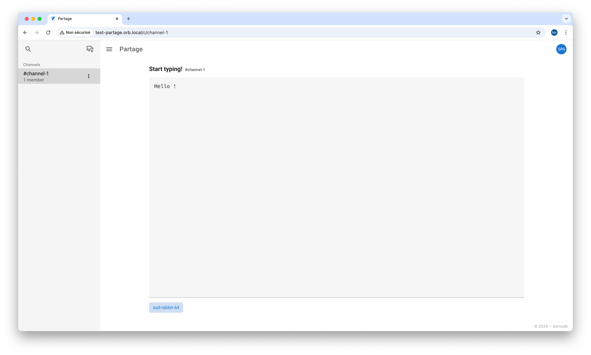

# Partage



### Prerequisites

- [Bun](https://bun.sh/)
- [Rust](https://www.rust-lang.org/tools/install)
- [Bacon](https://dystroy.org/bacon/)

### Development

#### Backend

- Sqlx setup

```bash
sqlx database create
sqlx migrate run
```

- Start the backend server

```bash
bacon
```

- Generate types (bindings) for the frontend

```bash
cargo test
```

#### Frontend

```bash
cd client
bun run dev
```

Open [http://localhost:13124](http://localhost:13124) in your browser.

### Docker

```bash
docker build -t test-partage .
docker run --rm --name test-partage -p 20000:3001 test-partage sh
```

For `docker-compose.yml`:

```yaml
services:
  partage:
    image: ghcr.io/kernoeb/partage:main
    ports:
      - 20000:3001
```

### Acknowledgements

- [Axum Websockets example](https://github.com/tokio-rs/axum/blob/main/examples/websockets/src/main.rs)
- [Rust-Embed example](https://github.com/pyrossh/rust-embed/blob/master/examples/axum-spa/main.rs)
- [Chatr](https://github.com/0xLaurens/chatr) by 0xLaurens for the backend inspiration

### TODO

- [ ] Tests
- [ ] Documentation
- [x] Persistence for new channels
- [x] Feature : no database
